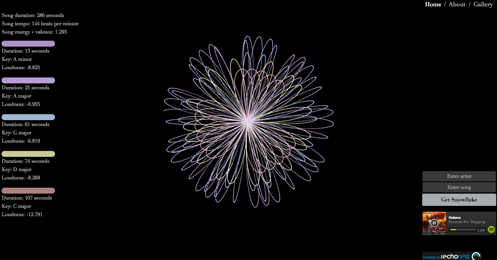
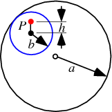
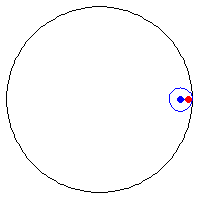
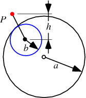
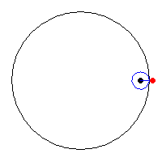

Audio Snowflake
===============

Audio Snowflake (www.audiosnowflake.com) is a music visualizer inspired by Spirograph and by the principles of [cymatics](http://en.wikipedia.org/wiki/Cymatics). Enter an artist name and song title, and Audio Snowflake retrieves detailed data on the song from the Echo Nest Analyzer API. 

After processing and scaling the data, the app uses Processing (a Java-based language commonly used in digital art) and a trigonometric equation to plot a series of hypotrochoids (Spirograph-like images) to the screen. 

The result is a beautiful visual representation of each song’s unique qualities, rendered before your eyes as you listen to the song via an embedded Spotify web player.

Below is a selection of songs from the Gallery page. 

Relationships between the images and the song's acoustics and composition are detailed below.

The Mapping
----------
The following sections explain how a snowflake's visual attributes map to the song's musical attributes. When using Audio Snowflake, you can reveal a legend that details the song's attributes by hovering over the image. 

Below is a sample snowflake ("Neighborhood #1" by Arcade Fire).

 

#### Rotation => Song Tempo
Snowflakes spin in the browser at a rotation speed that is directly proportional to the song's tempo (the faster the tempo, the faster the rotation). The difference may appear slight; this is purposeful. If the snowflake spins too quickly, it can make the viewer feel dizzy. 

You may find you disagree with the tempo that is displayed in the song data that appears when you hover over a snowflake. The fact is that measuring tempo (as well as many other musical properities) is still a relatively unsolved problem. The Echo Nest (whose data I used for Audio Snowflake) is arguably the best in the world when it comes to music information retrieval, and yet their data is not always accurate.

#### Lines => Song Sections
Each line in a snowflake represents a different "section" of a song. A "section" can be defined as a point in the song when the music changes in some significant way. (For more on sections, see **The Data**, below.) This change is usually a key change, but it can also be a mode change (from minor to major, or vice versa), or a change in time signature, tempo, or loudness. 

Oftentimes a song will change key (for a bridge, for example) and then go back to a key it was in before. As such, it is often the case that several of a song's sections may actually be identical in terms of key, mode, time signature, and loudness. For the purposes of Audio Snowflake, I collapse such sections into one composite section and compute the total duration for it.

I then compute the total number of sections. If there are more than five, I remove those of least duration until there are no more than five. This is an aesthetic choice--too many line drawings can start to be overwhelming.

#### Colors (HSBa)
Each line (section) is colored using HSBa (hue, saturation, brightness, opacity/alpha) color values. 

###### Hue => Section Key
The hue (color) is determined by the section's key. C gets a hue of 0 (red), and as the chromatic scale progresses, the hue progresses through the color spectrum (orange, yellow, and so forth).

###### Saturation => Song Valence + Energy
The saturation (vividness) is determined by the sum of the song's energy and valence, which together are a good approximation of a song's mood. 

Energy is a property of the loudness and frequency of change within a song. Valence is a measure of emotion within a song. (The Echo Nest determines valence using machine learning: a human defines the emotion on a set of songs, and that information is used to train the model.) According to Paul Lamere (Director of Developer Platform at The Echo Nest), 
>The term "valence" comes from psychology. It is a measure of the emotional content of a song. A value close to one indicates a positive emotion, while a value close to zero is a negative emotion. Valence is often combined with energy to yield a four-quadrant mood.

For this reason, I chose to make energy and valence relate to how saturated, or vivid, a color is. The maximum saturation level is still quite low (currently at 40); this was an aesthetic choice. If saturation is much higher, the snowflakes are less pleasing to look at, and the colors are more likely to clash with each other.

###### Brightness => (Constant Max)
The brightness is a constant: all songs have the maximum brightness value. Because I chose to use a black background and low saturation, maintaining brightness at the maximum is necessary (otherwise, some lines would be challenging or even impossible to see).

###### Opacity => Section Loudness
The opacity (alpha) value is determined by a section's loudness: the quieter a song, the more transparent the line/color. Loudness is measured in decibels and is almost always a negative number for music.

The Geometry
------------
Each line forms a geometric shape called a *hypotrochoid* (pronounced hai-po-**tro**-koid).

Hypotrochoids are mathematical roulettes traced by a point ***P*** that is attached to circle which rolls around the interior of a larger circle. If you have played with Spirograph, you may be familiar with the concept.

The shape of any hypotrochoid is determined by the radius ***a*** of the large circle, the radius ***b*** of the small circle, and the distance ***h*** between the center of the smaller circle and point ***P***.

For Audio Snowflake, these values are determined as follows: 

* ***a***: song duration

* ***b***: section duration

* ***h***: song duration minus section duration

Note that with Spirograph, the value of ***h*** must necessarily be less than the value of ***b***, because you have to place the pen somewhere inside the smaller circle. That's not the case with digital renderings: the "pen" can be outside the smaller circle, yet still attached to its rotation. The drawings below make this clear.

###### A hypotrochoid in which the value of *h* is less than the radius *b*. 

###### A hypotrochoid in which the value of *h* is greater than the radius *b*. 
Images from [Wolfram MathWorld](http://mathworld.wolfram.com/Hypotrochoid.html).

The Math
--------

The hypotrochoids are rendered as x,y coordinates on a Cartesian grid using the following trigonometric equation and the values described in the above section on the geometry. (The value ***t*** is an angle that increments very slightly after each x,y coordinate is computed.)

*x* = (*a−b*) x cos *t* + *h* x cos( (*a−b*) ÷ *b*) x *t*)

*y* = (*a−b*) x sin *t* - *h* x sin( (*a−b*) ÷ *b*) x *t*)

The Cartesian grid is scaled according to the window size at the time the page loads.

The Data
--------

[The Echo Nest Analyze API](http://developer.echonest.com/docs/v4/_static/AnalyzeDocumentation.pdf) supplies extremely detailed song data, measuring as finely as the onset and duration of each microbeat of a song. Other qualities, such as key, mode (major or minor), tempo, time signature, etc. are provided as well, as are more nuanced qualities, such as "danceability," "speechiness," "acousticness," "liveness," and so on.

The song data is analyzed on several different scales: segments, sections, beats, and tatums (sub-beats). The grouping I chose to focus on for this project are "sections." In Echo Nest's data, a new "section" denotes a significant change in the music. This change can be a change in key, mode, tempo, loudness, time signature, and so forth.

The sections data was more relevant to Audio Snowflake, as one of my goals was to visually represent the composition of a song.

The Acknowledgments
---------------------
Audio Snowflake is a music visualizer created by Wendy Dherin in 2014.
The imagery is inspired by Spirograph and [cymatics](http://en.wikipedia.org/wiki/Cymatics) and were made possible by the detailed track analysis information supplied by the Echo Nest API. The embedded web player is made possible by Spotify.

In addition to the support of my husband and fellow Hackbright fellows, the following people were instrumental to the project, providing mentorship, inspiration, and guidance:

###### Hackbright Instructors
* Nick Audo
* Nick Avgerinos
* Lindsay Cade
* Cynthia Dueltgen
* Joel Burton
* Katie LeFevre
* Meggie Mahnken
* Sean Teague

###### Mentors

* Andy Bartholomew
* Pamela Fox
* Kristin Henry
* Brenda Jin
* Beth Jubera
* Lynn Root
* Ava St. John
* Jeff Tchang
* Steve Tjoa

###### Friends & Family
* Benoit Dherin
* Penelope Cameron
